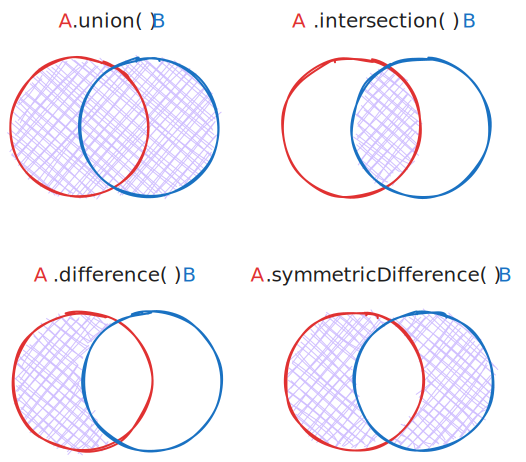
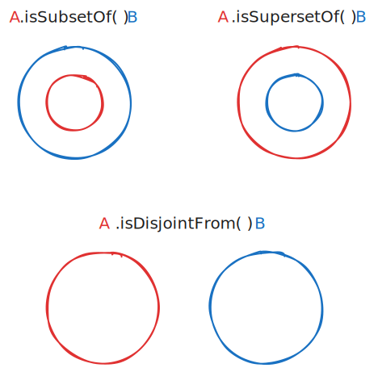

# [ES2015] Map/Set {#map-and-set}

JavaScriptでデータの集まり（コレクション）を扱うビルトインオブジェクトは、ObjectやArrayだけではありません。
この章では、ES2015で導入されたマップ型のコレクションである`Map`と、セット型のコレクションである`Set`について学びます。

## Map {#map}

[Map][]はマップ型のコレクションを扱うためのビルトインオブジェクトです。
マップとは、キーと値の組み合わせからなる抽象データ型です。
他のプログラミング言語の文脈では辞書やハッシュマップ、連想配列などと呼ばれることもあります。

### マップの作成と初期化 {#map-new}

`Map`オブジェクトを`new`することで、新しいマップを作成できます。
作成されたばかりのマップは何も持っていません。
そのため、マップが持つ要素の数を返す`size`プロパティは`0`を返します。

{{book.console}}
```js
const map = new Map();
console.log(map.size); // => 0
```

`Map`オブジェクトを`new`で初期化するときに、コンストラクタに初期値を渡せます。
コンストラクタ引数として渡せるのは**エントリー**の配列です。
エントリーとは、1つのキーと値の組み合わせを`[キー, 値]`という形式の配列で表現したものです。

次のコードでは、Mapに初期値となるエントリー（配列）の配列を渡しています。

{{book.console}}
```js
const map = new Map([["key1", "value1"], ["key2", "value2"]]);
// 2つのエントリーで初期化されている
console.log(map.size); // => 2
```

### 要素の追加と取り出し {#map-read-and-write}

`Map`には新しい要素を`set`メソッドで追加でき、追加した要素を`get`メソッドで取り出せます。

`set`メソッドは特定のキーと値を持つ要素をマップに追加します。
ただし、同じキーで複数回`set`メソッドを呼び出した際は、後から追加された値で上書きされます。

`get`メソッドは特定のキーにひもづいた値を取り出します。
また、特定のキーにひもづいた値を持っているかを確認する`has`メソッドがあります。

{{book.console}}
```js
const map = new Map();
// 新しい要素の追加
map.set("key", "value1");
console.log(map.size); // => 1
console.log(map.get("key")); // => "value1"
// 要素の上書き
map.set("key", "value2");
console.log(map.get("key")); // => "value2"
// キーの存在確認
console.log(map.has("key")); // => true
console.log(map.has("foo")); // => false
```

`delete`メソッドはマップから要素を削除します。
`delete`メソッドに渡されたキーと、そのキーにひもづいた値がマップから削除されます。
また、マップが持つすべての要素を削除するための`clear`メソッドがあります。

{{book.console}}
```js
const map = new Map();
map.set("key1", "value1");
map.set("key2", "value2");
console.log(map.size); // => 2
map.delete("key1");
console.log(map.size); // => 1
map.clear();
console.log(map.size); // => 0
```

### マップの反復処理 {#map-iteration}

マップが持つ要素を列挙するメソッドとして、`forEach`、`keys`、`values`、`entries`があります。

`forEach`メソッドはマップが持つすべての要素を、マップへの挿入順に反復処理します。
コールバック関数には引数として値、キー、マップの3つが渡されます。
配列の`forEach`メソッドと似ていますが、インデックスの代わりにキーが渡されます。
配列はインデックスにより要素を特定しますが、マップはキーにより要素を特定するためです。

{{book.console}}
```js
const map = new Map([["key1", "value1"], ["key2", "value2"]]);
const results = [];
map.forEach((value, key) => {
    results.push(`${key}:${value}`);
});
console.log(results); // => ["key1:value1","key2:value2"]
```

`keys`メソッドはマップが持つすべての要素のキーを挿入順に並べた**Iterator**オブジェクトを返します。
同様に、`values`メソッドはマップが持つすべての要素の値を挿入順に並べたIteratorオブジェクトを返します。
これらの返り値はIteratorオブジェクトであって配列ではありません。
そのため、次の例のように`for...of`文で反復処理を行ったり、`Array.from`静的メソッドに渡して配列に変換して使ったりします。

{{book.console}}
```js
const map = new Map([["key1", "value1"], ["key2", "value2"]]);
const keys = [];
// keysメソッドの返り値(Iterator)を反復処理する
for (const key of map.keys()) {
    keys.push(key);
}
console.log(keys); // => ["key1","key2"]
// keysメソッドの返り値(Iterator)から配列を作成する
const keysArray = Array.from(map.keys());
console.log(keysArray); // => ["key1","key2"]
```

`entries`メソッドはマップが持つすべての要素をエントリーとして挿入順に並べたIteratorオブジェクトを返します。
先述のとおりエントリーは`[キー, 値]`の配列です。
そのため、配列の分割代入を使うとエントリーからキーと値を簡単に取り出せます。

{{book.console}}
```js
const map = new Map([["key1", "value1"], ["key2", "value2"]]);
const entries = [];
for (const [key, value] of map.entries()) {
    entries.push(`${key}:${value}`);
}
console.log(entries); // => ["key1:value1","key2:value2"]
```

また、マップ自身もiterableなオブジェクトなので、`for...of`文で反復処理できます。
マップを`for...of`文で反復したときは、すべての要素をエントリーとして挿入順に反復処理します。
つまり、`entries`メソッドの返り値を反復処理するときと同じ結果が得られます。

{{book.console}}
```js
const map = new Map([["key1", "value1"], ["key2", "value2"]]);
const results = [];
for (const [key, value] of map) {
    results.push(`${key}:${value}`);
}
console.log(results); // => ["key1:value1","key2:value2"]
```

### [ES2024] `Map.groupBy`静的メソッド {#map-group-by}

`Map.groupBy`静的メソッドでは、配列からグループ分けしたマップを作成できます。
これは配列からグループ分けしたオブジェクトを作成する[`Object.groupBy`][]と同じく、ES2024で追加されたメソッドです。

`Map.groupBy`静的メソッドは、第一引数に配列などのiterableオブジェクト、第二引数にグループ分けの条件を返すコールバック関数を渡します。
次のコードでは、配列`votes`の各要素の`vote`プロパティの値を使って、`yes`と`no`にグループ分けしたマップを作成しています。

{{book.console}}
<!-- doctest:meta:{ "ECMAScript": 2024 } -->
```js
const votes = [
    { id: 1, vote: "yes" },
    { id: 2, vote: "no" },
    { id: 3, vote: "yes" },
    { id: 4, vote: "yes" },
    { id: 5, vote: "no" },
];
const groupedVotes = Map.groupBy(votes, (vote) => vote.vote);
console.log(groupedVotes.get("yes")); // => [{ id: 1, vote: "yes" }, { id: 3, vote: "yes" }, { id: 4, vote: "yes" }]
console.log(groupedVotes.get("no")); // => [{ id: 2, vote: "no" }, { id: 5, vote: "no" }]
```

### マップとしてのObjectとMap {#object-and-map}

ES2015で`Map`が導入されるまで、JavaScriptにおいてマップ型を実現するために`Object`が利用されてきました。
何かをキーにして値にアクセスするという点で、`Map`と`Object`はよく似ています。
ただし、マップとしての`Object`にはいくつかの問題があります。

- `Object`の`prototype`オブジェクトから継承されたプロパティによって、意図しないマッピングを生じる危険性がある
- また、プロパティとしてデータを持つため、キーとして使えるのは文字列か`Symbol`に限られる

`Object`には`prototype`オブジェクトがあるため、いくつかのプロパティは初期化されたときから存在します。
<!-- textlint-disable -->
`Object`をマップとして使うと、そのプロパティと同じ名前のキーを使おうとしたときに問題となります
<!-- textlint-enable -->
（詳細は「[オブジェクト][]」の章の「[プロパティの存在を確認する][]」を参照）。

たとえば`constructor`という文字列は`Object.prototype.constructor`プロパティと衝突してしまいます。
そのため`constructor`のような文字列をオブジェクトのキーに使うことで意図しないマッピングを生じる危険性があります。

{{book.console}}
```js
const map = {};
// マップがキーを持つことを確認する
function has(key) {
    return typeof map[key] !== "undefined";
}
console.log(has("foo")); // => false
// Objectのプロパティが存在する
console.log(has("constructor")); // => true
```

このマップとして使うオブジェクトの問題は、`Object`のインスタンスを`Object.create(null)`のように初期化して作ることで回避されてきました
（詳細は「[プロトタイプオブジェクト][]」の章の「[`Object.prototype`を継承しないオブジェクト][]」を参照）。

ES2015では、これらの問題を根本的に解決する`Map`が導入されました。
`Map`はプロパティとは異なる仕組みでデータを格納します。
そのため、`Map`のプロトタイプが持つメソッドやプロパティとキーが衝突することはありません。
また、`Map`ではマップのキーとしてあらゆるオブジェクトを使えます。

たとえば、オブジェクトを`Map`のキーとして利用する場合、それぞれのオブジェクトは参照によって区別されます。
そのため、見た目が同じでも参照が異なるオブジェクトは、`Map`内では異なるキーとして扱われます。

{{book.console}}
```js
const map = new Map();
// 2つの異なるオブジェクトを作成
const keyObj1 = {};
const keyObj2 = {};
// それぞれのオブジェクトを`Map`のキーにして値をセットする
map.set(keyObj1, "value for keyObj1");
map.set(keyObj2, "value for keyObj2");
// オブジェクトの参照がキーとなるため、異なる値を取得できる
console.log(map.get(keyObj1)); // => "value for keyObj1"
console.log(map.get(keyObj2)); // => "value for keyObj2"
// Mapのサイズは2
console.log(map.size); // => 2
```

`Object`自体をマップとして使うときに起きる多くの問題は、`Map`オブジェクトを使うことで解決しますが、
常に`Map`が`Object`の代わりになるわけではありません。
マップとしての`Object`には次のような利点があります。

- リテラル表現があるため作成しやすい
- 規定のJSON表現があるため、`JSON.stringify`関数を使ってJSONに変換するのが簡単
- ネイティブAPI・外部ライブラリを問わず、多くの関数がマップとして`Object`を渡される設計になっている

次の例では、ログインフォームのsubmitイベントを受け取ったあと、サーバーにPOSTリクエストを送信しています。
サーバーにJSON文字列を送るために、`JSON.stringify`関数を使います。
そのため、`Object`のマップを作ってフォームの入力内容を持たせています。
このような簡易なマップにおいては、`Object`を使うほうが適切でしょう。

```js
// URLとObjectのマップを受け取ってPOSTリクエストを送る関数
function sendPOSTRequest(url, data) {
    // fetchを使ってPOSTリクエストを送る
    fetch(url, {
        method: "POST",
        headers: { "Content-Type": "application/json" },
        body: JSON.stringify(data),
    }).catch((error) => {
        console.error(error);
    });
}

// formのsubmitイベントを受け取る関数
function onLoginFormSubmit(event) {
    const form = event.target;
    const data = {
        userName: form.elements.userName,
        password: form.elements.password,
    };
    sendPOSTRequest("/api/login", data);
}
```

### WeakMap {#weakmap}

[WeakMap][]は、`Map`と同じくマップを扱うためのビルトインオブジェクトです。
`Map`と違う点は、キーを**弱い参照**（Weak Reference）で持つことです。

[弱い参照][]とは、ガベージコレクション（GC）によるオブジェクトの解放を妨げないための特殊な参照です。
本来、GCによりメモリから解放できるオブジェクトは、どこからも参照されていないものだけです。
弱い参照は例外的に、該当するオブジェクトへの弱い参照があったとしても、GCはそのオブジェクトを解放できます。

そのため、弱い参照は不要になったオブジェクトを参照し続けて発生してしまうメモリリークを防ぐために使われます。
`WeakMap`では不要になったキーとそれにひもづいた値が自動的に削除されるため、メモリリークを引き起こす心配がありません。

次のコードでは、最初に`obj`には`{}`を設定し、`WeakMap`ではその`obj`をキーにして値（`"value"`）を設定しています。
次に`obj`に別の値（ここでは`null`）を代入すると、`obj`が元々参照していた`{}`という値はどこからも参照されなくなります。
このとき`WeakMap`は`{}`への弱い参照を持っていますが、弱い参照はGCを妨げないため、`{}`は不要になった値としてGCによりメモリから解放されます。

同時に、`WeakMap`は解放されたオブジェクト（`{}`）をキーにしてひもづいていた値（`"value"`）を破棄できます。
ただし、どのタイミングで実際にメモリから解放するかは、JavaScriptエンジンの実装に依存します。

```js
const map = new WeakMap();
// キーとなるオブジェクト
let obj = {};
// {} への参照をキーに値をセットする
map.set(obj, "value");
// {} への参照を破棄する
obj = null;
// GCが発生するタイミングでWeakMapから値が破棄される
```

`WeakMap`は`Map`と似ていますがiterableではありません。
そのため、キーを列挙する`keys`メソッドや、データの数を返す`size`プロパティなどは存在しません。
また、キーを弱い参照で持つ特性上、キーとして使えるのは参照型のオブジェクトと`Symbol`[^es2023]だけです。

`WeakMap`の主な使い方のひとつは、クラスにプライベートの値を格納することです。
`this` （クラスインスタンス） を `WeakMap` のキーにすることで、インスタンスの外からはアクセスできない値を保持できます。
また、クラスインスタンスが参照されなくなったときには自動的に解放されます。

次のコードでは、オブジェクトが発火するイベントのリスナー関数（イベントリスナー）を `WeakMap` で管理しています。
イベントリスナーとは、イベントが発生したときに呼び出される関数のことです。
このマップを`Map`で実装してしまうと、明示的に削除されるまでイベントリスナーはメモリ上に残り続けます。
ここで`WeakMap`を使うと、`addListener` メソッドに渡された`listener`は `EventEmitter` インスタンスが参照されなくなった際、自動的に解放されます。

<!-- doctest:meta:{ "ECMAScript": 2020 } -->
```js
// イベントリスナーを管理するマップ
const listenersMap = new WeakMap();

class EventEmitter {
    addListener(listener) {
        // this(インスタンス)にひもづいたリスナーの配列を取得する
        const listeners = listenersMap.get(this) ?? [];
        const newListeners = listeners.concat(listener);
        // this をキーにして、新しいリスナーの配列をセットする
        listenersMap.set(this, newListeners);
    }
    // ...EventEmitterには他にもメソッドがあるが省略...
}

// `event`は`EventEmitter`のインスタンスへの参照をもつ
let event = new EventEmitter();
// `EventEmitter`のインスタンスへイベントリスナーを追加する
event.addListener(() => {
    // `EventEmitter`のインスタンスに紐づくイベントリスナーの処理
});
// `event`へ`null`を代入することで、`EventEmitter`のインスタンスへの参照がなくなる
// インスタンスがどこからも参照されなくなったため、紐づいていたイベントリスナーが自動的に解放される
event = null;
```

また、あるオブジェクトから計算した結果を一時的に保存する用途でもよく使われます。
次の例ではHTML要素の高さを計算した結果を保存して、2回目以降に同じ計算をしないようにしています。

```js
const cache = new WeakMap();

function getHeight(element) {
    if (cache.has(element)) {
        return cache.get(element);
    }
    const height = element.getBoundingClientRect().height;
    // elementオブジェクトに対して高さをひもづけて保存している
    cache.set(element, height);
    return height;
}
```

### [コラム] キーの等価性とNaN {#key-and-nan}

`Map`に値をセットする際のキーにはあらゆるオブジェクトが使えます。
このときのマップが特定のキーをすでに持っているか、つまり挿入と上書きの判定は基本的に`===`演算子と同じです。

ただし、キーが`NaN`の扱いだけが例外的に違います。`Map`におけるキーの比較では、`NaN`同士は常に等価であるとみなされます。
この挙動は[Same-value-zero][]アルゴリズムと呼ばれます。

次のコードでは、`NaN`同士の`===`の比較結果が`false`になるのに対して、`Map`のキーでは`NaN`同士の比較結果が一致していることがわかります。

{{book.console}}
```js
const map = new Map();
map.set(NaN, "value");
// NaNは===で比較した場合は常にfalse
console.log(NaN === NaN); // => false
// MapはNaN同士を比較できる
console.log(map.has(NaN)); // => true
console.log(map.get(NaN)); // => "value"
```

## Set {#set}

[Set][]はセット型のコレクションを扱うためのビルトインオブジェクトです。
セットとは、重複する値がないことを保証したコレクションのことを言います。
`Set`は追加した値を列挙できるので、値が重複しないことを保証する配列のようなものとしてよく使われます。
ただし、配列と違って要素は順序を持たず、インデックスによるアクセスはできません。

### セットの作成と初期化 {#set-new}

`Set`オブジェクトを`new`することで、新しいセットを作れます。
作成されたばかりのセットは何も持っていません。
そのため、セットが持つ要素の数を返す`size`プロパティは0を返します。

{{book.console}}
```js
const set = new Set();
console.log(set.size); // => 0
```

`Set`オブジェクトを`new`で初期化するときに、コンストラクタに初期値を渡せます。
コンストラクタ引数として渡せるのはiterableオブジェクトです。

次のコードではiterableオブジェクトである配列を初期値として渡しています。
また、`Set`では重複する同じ値を持たないことを保証するため、同じ値は1つのみ格納されます。

{{book.console}}
```js
// "value2"が重複するため、片方は無視される
const set = new Set(["value1", "value2", "value2"]);
// セットのサイズは2になる
console.log(set.size); // => 2
```

### 値の追加と取り出し {#set-read-and-write}

作成したセットに値を追加するには、`add`メソッドを使います。
先述のとおり、セットは重複する値を持たないことが保証されます。
そのため、すでにセットが持っている値を`add`メソッドに渡した際は無視されます。

また、セットが特定の値を持っているかどうかを確認する`has`メソッドがあります。

{{book.console}}
```js
const set = new Set();
// 値の追加
set.add("a");
console.log(set.size); // => 1
// 重複する値は追加されない
set.add("a");
console.log(set.size); // => 1
// 値の存在確認
console.log(set.has("a")); // => true
console.log(set.has("b")); // => false
```

セットから値を削除するには、`delete`メソッドを使います。
`delete`メソッドに渡された値がセットから削除されます。
また、セットが持つすべての値を削除するための`clear`メソッドがあります。

{{book.console}}
```js
const set = new Set();
set.add("a");
set.add("b");
console.log(set.size); // => 2
set.delete("a");
console.log(set.size); // => 1
set.clear();
console.log(set.size); // => 0
```

### セットの反復処理 {#set-iteration}

セットが持つ値を反復処理するには、`forEach`メソッドが利用できます。
`forEach`メソッドではセットが持つすべての要素を、セットへの挿入順に反復します。

{{book.console}}
```js
const set = new Set(["a", "b"]);
const results = [];
set.forEach((value) => {
    results.push(value);
});
console.log(results); // => ["a","b"]
```

セットからIteratorオブジェクトを作成するメソッドとして`keys`、`values`、`entries`があります。
これらは`Map`との類似性のために存在しますが、セットにはマップにおけるキー相当のものがありません。
そのため、`keys`メソッドは`values`メソッドのエイリアスになっており、セットが持つすべての値を挿入順に列挙するIteratorオブジェクトを返します。
また、`entries`メソッドは`[値, 値]`という形のエントリーを挿入順に列挙するIteratorオブジェクトを返します。

{{book.console}}
```js
const set = new Set(["a", "b"]);
// keysで列挙
const keysResults = [];
for (const value of set.keys()) {
    keysResults.push(value);
}
console.log(keysResults); // => ["a","b"]
// entriesで列挙
const entryResults = [];
for (const entry of set.entries()) {
    // entryは[値, 値]という配列
    entryResults.push(entry);
}
console.log(entryResults); // => [["a","a"], ["b", "b"]]
```

`Set`オブジェクト自身もiterableなオブジェクトであるため`for...of`文で反復処理できます。
`for...of`文で`Set`オブジェクトを反復処理したときも、セットへの挿入順に値が取り出されます。
`keys`、`values`、`entries`メソッドはどれも取得できる情報は同じであるため、基本的には`Set`オブジェクト自体を反復処理することで代用できます。

{{book.console}}
```js
const set = new Set(["a", "b"]);
const results = [];
for (const value of set) {
    results.push(value);
}
console.log(results); // => ["a","b"]
```

### [ES2025] 集合演算メソッド {#set-operation-methods}

ES2025では、`Set`オブジェクトに集合演算を行うためのメソッドが追加されました。これらのメソッドは大きく2種類に分けられます。

#### 新しい集合を返すメソッド {#set-creation-methods}

次のメソッドは、2つの集合から新しい`Set`オブジェクトを作成して返します。

- `Set.prototype.union(other)`<sup>[ES2025]</sup>: 和集合を返す（両方の集合のすべての要素を含む集合）
- `Set.prototype.intersection(other)`<sup>[ES2025]</sup>: 積集合を返す（両方の集合に共通する要素のみの集合）
- `Set.prototype.difference(other)`<sup>[ES2025]</sup>: 差集合を返す（元の集合から、引数の集合に含まれる要素を除いた集合）
- `Set.prototype.symmetricDifference(other)`<sup>[ES2025]</sup>: 対称差集合を返す（どちらか一方の集合にのみ含まれる要素の集合）

具体的な例を見てみましょう。

{{book.console}}
<!-- doctest:meta:{ "ECMAScript": "2025" } -->
```js
const setA = new Set([1, 2, 3, 4, 5]);
const setB = new Set([3, 4, 5, 6, 7]);

// 和集合 (A∪B): セットAとセットBのすべての要素を含む集合
const unionSet = setA.union(setB);
console.log([...unionSet]); // => [1, 2, 3, 4, 5, 6, 7]

// 積集合 (A∩B): セットAとセットBの両方に存在する要素のみの集合
const intersectionSet = setA.intersection(setB);
console.log([...intersectionSet]); // => [3, 4, 5]

// 差集合 (A-B): セットAからセットBに含まれる要素を除いた集合
const differenceSet = setA.difference(setB);
console.log([...differenceSet]); // => [1, 2]

// 対称差集合 (A△B): セットAとセットBのどちらか一方にのみ存在する要素の集合
const symmetricDifferenceSet = setA.symmetricDifference(setB);
console.log([...symmetricDifferenceSet]); // => [1, 2, 6, 7]
```

これらの集合演算を視覚的に表すと次のようになります。



#### 集合の関係を判定するメソッド {#set-relation-methods}

次のメソッドは、2つの集合の関係性を判定し、真偽値を返します。

- `Set.prototype.isSubsetOf(other)`<sup>[ES2025]</sup>: このセットが引数のセットの部分集合であるかの真偽値を返す
- `Set.prototype.isSupersetOf(other)`<sup>[ES2025]</sup>: このセットが引数のセットの上位集合であるかの真偽値を返す
- `Set.prototype.isDisjointFrom(other)`<sup>[ES2025]</sup>: このセットと引数のセットが互いに素（共通要素がない）であるかの真偽値を返す

具体的な例を見てみましょう。

{{book.console}}
<!-- doctest:meta:{ "ECMAScript": "2025" } -->
```js
const superSet = new Set([1, 2, 3, 4, 5]);
const subSet = new Set([2, 3]);
const overlappingSet = new Set([3, 4, 5, 6]);
const disjointSet = new Set([6, 7, 8]);

// 部分集合の判定
console.log(subSet.isSubsetOf(superSet)); // => true
console.log(overlappingSet.isSubsetOf(superSet)); // => false

// 上位集合の判定
console.log(superSet.isSupersetOf(subSet)); // => true
console.log(superSet.isSupersetOf(overlappingSet)); // => false

// 互いに素（共通要素がない）の判定
console.log(superSet.isDisjointFrom(disjointSet)); // => true
console.log(superSet.isDisjointFrom(overlappingSet)); // => false
```

これらの集合演算を視覚的に表すと次のようになります。



これらのメソッドを使うことで、数学的な集合操作をより簡単かつ効率的に行えるようになります。

### WeakSet {#weakset}

[WeakSet][]は弱い参照で値を持つセットです。
`WeakSet`は`Set`と似ていますが、iterableではないので追加した値を反復処理できません。
つまり、`WeakSet`は値の追加と削除、存在確認以外のことができません。
また、ES2025で`Set`に追加された集合演算メソッドも`WeakSet`では利用できません。
データの格納ではなく、データの一意性を確認することに特化したセットと言えるでしょう。

また、弱い参照で値を持つ特性上、`WeakSet`の値として使えるのは参照型のオブジェクトと`Symbol`[^es2023]だけです。

## まとめ {#conclusion}

この章ではMapとSetについて学びました。

- `Map`はキーと値の組み合わせからなるコレクションを扱うビルトインオブジェクト
- `Map`のキーはプロトタイプオブジェクトのプロパティと名前が衝突しないため意図しないマッピングを避けられる
- `WeakMap`はキーを弱い参照で持つ`Map`と同様のビルトインオブジェクト
- `Set`は重複する値がないことを保証した順序を持たないコレクションを扱うビルトインオブジェクト
- `WeakSet`は値を弱い参照で持つ`Set`と同様のビルトインオブジェクト

[Map]: https://developer.mozilla.org/ja/docs/Web/JavaScript/Reference/Global_Objects/Map
[Same-value-zero]: https://developer.mozilla.org/ja/docs/Web/JavaScript/Equality_comparisons_and_sameness#Same-value-zero_equality
[Set]: https://developer.mozilla.org/ja/docs/Web/JavaScript/Reference/Global_Objects/Set
[WeakMap]: https://developer.mozilla.org/ja/docs/Web/JavaScript/Reference/Global_Objects/WeakMap
[WeakSet]: https://developer.mozilla.org/ja/docs/Web/JavaScript/Reference/Global_Objects/WeakSet
[弱い参照]: https://ja.wikipedia.org/wiki/%E5%BC%B1%E3%81%84%E5%8F%82%E7%85%A7
[オブジェクト]: ../object/README.md
[プロパティの存在を確認する]: ../object/README.md#confirm-property
[プロトタイプオブジェクト]: ../prototype-object/README.md
[`Object.prototype`を継承しないオブジェクト]: ../prototype-object/README.md#not-inherit-object
[`Object.groupBy`]: ../array/README.md#object-group-by

[^es2023]: ES2023でSymbolも扱えるように仕様が変更されています。
